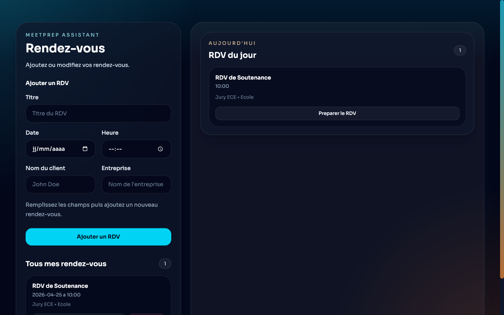
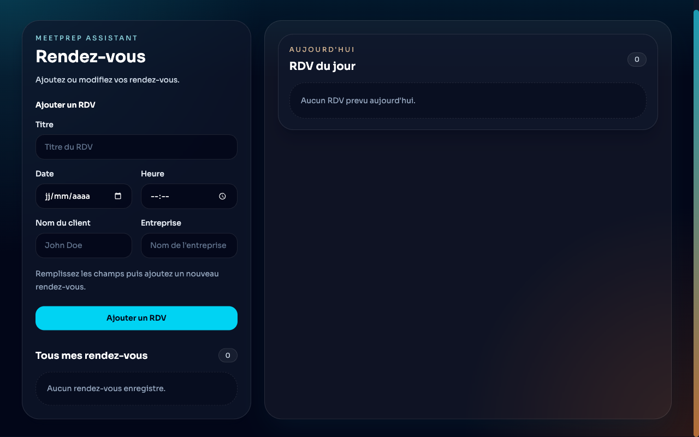
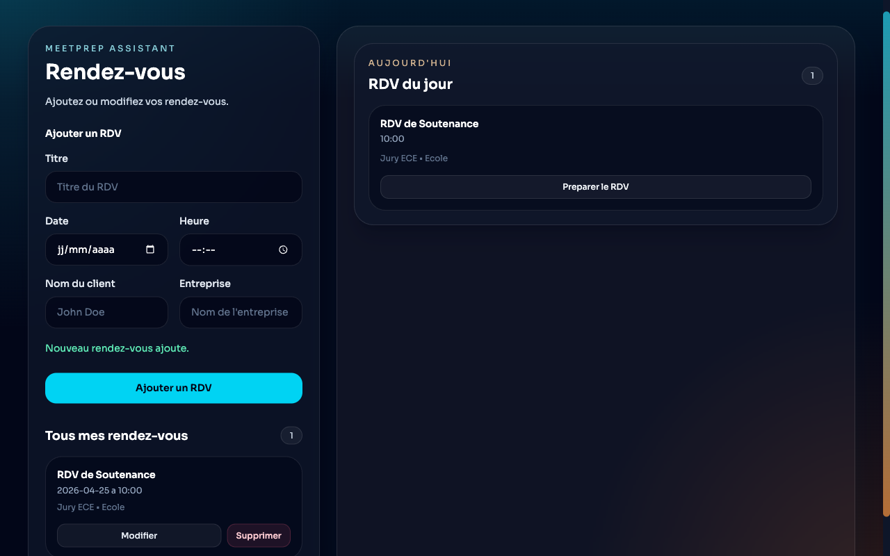
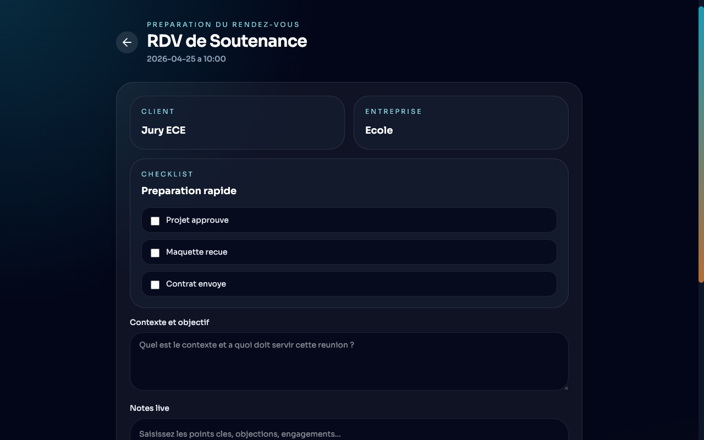

# MeetPrep Assistant

Application desktop Electron pour preparer des rendez-vous client, prendre des notes en direct et generer un compte-rendu PDF.

## 1. Objectif

L application sert a :

- creer un rendez-vous client
- modifier ou supprimer un rendez-vous
- afficher les rendez-vous du jour
- ouvrir un rendez-vous dans une page de preparation dediee
- suivre une checklist de preparation
- saisir un contexte, un objectif et des notes live
- generer un vrai PDF dans le dossier `Downloads`


## 2. Seed de demonstration

Au premier lancement, si la base de donnees est vide, l application cree automatiquement un rendez-vous de demonstration pour faciliter les tests.

Le seed contient :

- client : `Mohamed Saadi`
- entreprise : `SNCF`
- date : la date du jour
- heure : `10:30`
- contexte : un texte de demonstration
- notes : un texte de demonstration 
- checklist : 3 points pre-remplis

Ce seed est defini dans [src/shared/appointments.ts].

## 3. Mise en route

### Prerequis

- Node.js
- npm

### Installation

```bash
npm install
```

### Lancement

```bash
npm start
```

### Verification du code et Tests

```bash
# Linter le code
npm run lint

# Lancer les tests unitaires (Vitest)
npm run test

# Lancer les tests E2E (Playwright)
npm run test:e2e
```

> **Note sur les tests E2E (Playwright)** :
> Le test End-to-End (`e2e/example.spec.ts`) simule un utilisateur réel naviguant dans l'application. Avant de lancer ce test, il est recommandé de compiler l'application avec `npm run package` pour que l'interface React soit générée.
> 
> Le scénario de test automatisé suit ces étapes :
> 1. **Chargement de la page** : Vérifie que l'application s'ouvre et charge l'interface.
>    <br>
> 2. **Suppression du rendez-vous (seed)** : Identifie le bouton "Supprimer" du rendez-vous par défaut et nettoie la base de données.
>    <br>
> 3. **Ajout d'un nouveau RDV** : Remplit le formulaire de création de rendez-vous pour la date du jour, le soumet, et vérifie qu'il apparaît bien dans la liste.
>    <br>
> 4. **Navigation et Préparation** : Clique sur "Préparer le RDV" depuis la liste des rendez-vous du jour, et vérifie que la nouvelle page de préparation s'affiche correctement.
>    <br>

### Rapports d'Accessibilité et de Performance

L'application respecte les bonnes pratiques web modernes grâce à React et Vite, ainsi qu'une architecture optimisée en **Code Splitting** (fractionnement du code avec `React.lazy`).

Un audit complet a été généré avec **Google Lighthouse** (Performance, Accessibilité, Bonnes Pratiques, SEO).
- **Performance : ~97/100** (Grâce à l'absence de requêtes réseau et au lazy-loading des composants).
- **Accessibilité : ~100/100** (Grâce aux forts contrastes, balises sémantiques HTML et thèmes sombres adaptés).

Le rapport détaillé complet est disponible dans le fichier `reports/lighthouse-report-prod.html` (à ouvrir dans votre navigateur) ou `reports/lighthouse-report.html`.

## 4. Structure du projet

### Fichiers principaux

- [src/main.ts]
  Process principal Electron. Cree la fenetre desktop, gere le cycle de vie de l application et genere le PDF natif.

- [src/preload.ts]
  Pont securise entre le renderer et Electron. Expose une API minimale au `window`.

- [src/renderer.tsx]
  Partie interface (React + React Router). Gere l etat, le rendu, la navigation et les evenements utilisateur.

- [src/database.ts]
  Couche de persistance SQLite utilisant `sqlite3` pour des requetes asynchrones.

- [src/index.css]
  Styles globaux.

- [index.html]
  Point d entree HTML charge par Electron.

## 5. Comment fonctionne l'app Electron dans ce projet

### 5.1 Le process `main`

Le fichier [src/main.ts] correspond au coeur natif Electron.

Il s occupe de :

- creer la fenetre avec `BrowserWindow`
- charger l interface Vite ou les fichiers buildes
- ecouter les appels IPC venant du renderer (y compris les operations de base de donnees)
- generer le PDF avec `webContents.printToPDF()`
- ecrire le fichier PDF dans `Downloads`

### 5.2 Le `preload`

Le fichier [src/preload.ts] expose une API limitee pour dialoguer de maniere securisee avec le `main` :

- API base de donnees : `listAppointments`, `saveAppointment`, `deleteAppointment`, `savePreparation`
- API export : `exportPdf(...)`

Le renderer n appelle donc pas Electron ou `sqlite3` directement. Il passe par cette couche intermediaire, ce qui est plus propre et plus securise.

### 5.3 Le `renderer`

Le fichier [src/renderer.tsx] agit comme un frontend classique avec React :

- utilise `react-router-dom` pour la navigation multi-pages (Accueil et Preparation).
- maintient l'etat local en synchronisation avec le backend SQLite.
- genere l interface avec des composants React.
- demande au `main` d'effectuer les operations de lecture/ecriture en base ou la generation PDF.

## 6. Persistance des donnees

L application utilise **SQLite** via la librairie `sqlite3`.

Les donnees sont stockees localement dans un fichier `meetprep.sqlite` situe dans le dossier `userData` de l'application (chemin gere par Electron).

Concretement, cela veut dire :

- pas de serveur distant
- persistance locale performante grace a SQLite
- requetes asynchrones securisees
- etat retrouve apres fermeture / reouverture de l application

## 7. Entites metier

Le projet repose sur un modele de donnees relationnel (voir `src/database.ts` et `src/shared/appointments.ts`).

### 7.1 `Appointment`

Entite principale de l application.

```ts
type Appointment = {
  id: string;
  title: string;
  date: string;
  time: string;
  fields: FormFields;
  preparationChecklist: PreparationItem[];
};
```

### 7.2 `FormFields`

Bloc de contenu textuel rattache a un rendez-vous (contexte, notes).

### 7.3 `PreparationItem`

Element de checklist rattache a un rendez-vous (relation 1 a N dans SQLite via `preparation_items`).

## 8. Relations entre les entites

En logique de base de donnees (SQLite) :

- La table `appointments` contient tous les rendez-vous.
- La table `preparation_items` contient les items de checklist et possede une cle etrangere `appointment_id` liee a la table `appointments`.

## 9. Cycle de vie fonctionnel

### 9.1 Ajouter un rendez-vous

1. L utilisateur remplit le formulaire sur la page d'accueil.
2. Le contenu alimente l'etat local (draft).
3. Le submit appelle `window.meetPrep.saveAppointment`.
4. Le main process insere les donnees dans la table `appointments` via SQLite.
5. L interface se rafraichit avec la liste mise a jour.

### 9.2 Preparer un rendez-vous

1. Sur la page d'accueil, la section affiche les `RDV du jour`.
2. L utilisateur clique sur `Preparer le RDV`.
3. Le routeur React navigue vers la page `/prepare/:id`.
4. L'utilisateur modifie la checklist ou les notes.
5. Chaque modification declenche une requete IPC pour sauvegarder dans SQLite.

### 9.3 Exporter le PDF

1. Le renderer React construit un HTML de compte-rendu a partir de l'etat actuel.
2. Le renderer appelle `window.meetPrep.exportPdf(...)`.
3. Le `main` genere un vrai PDF natif.
4. Le PDF est ecrit dans `Downloads`.

## 10. Comportement de l interface

L interface est geree via une **navigation multi-pages** (React Router) :

### Page d'Accueil (`/`)

- formulaire d ajout / edition
- liste complete des rendez-vous
- liste des rendez-vous du jour avec un bouton pour preparer

### Page de Preparation (`/prepare/:id`)

- vue dediee a la prise de notes pour un rendez-vous precis.
- checklist, contexte, et editeur de notes live.
- bouton de generation PDF.
- bouton `Retour` pour revenir a la liste des rendez-vous sans perdre de donnees.


## 12. Evolutions possibles

- Ajouter une recherche ou un système de filtrage des rendez-vous par date.
- Permettre à l'utilisateur de choisir le dossier de destination du PDF.


